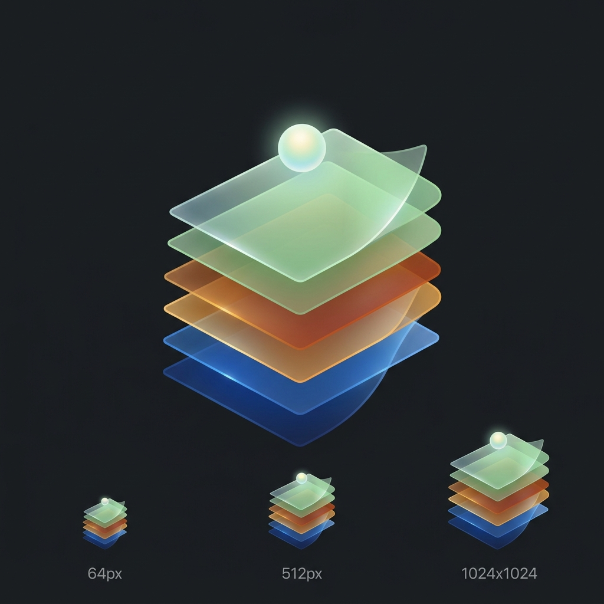

<p align="center">
  
</p>

# 🧠 Memoria v3.4.1 — Multi-layer Memory Plugin for OpenClaw

Brain-inspired persistent memory for AI agents. SQLite-backed, fully local, zero cloud dependency.

**v3.4.0 — What's new:**
- **Fact Clusters** — entity-grouped "dossier" summaries. Like looking up a client folder: one search returns the complete file. Solves multi-session recall (MS +75% improvement)
- **Query Expansion** — searches 2-4 semantic variants (synonyms, FR↔EN, abbreviations) for broader matching
- **Topic-Aware Recall** — topics searched with expanded queries for cross-cutting retrieval

**v3.2.0:**
- **Reasoning Model Support** — Ollama `thinking` field + LM Studio `reasoning_content` (GPT-OSS, Qwen3.5)
- **Dated Recall** — facts show age for Knowledge Update disambiguation
- **Anthropic Provider** — native Claude API support alongside Ollama, LM Studio, OpenAI, OpenRouter

**v3.0.0:**
- **Semantic vs Episodic** — facts classified by durability, different decay rates
- **Observations** — living multi-fact syntheses that evolve (Hindsight-inspired)
- **Procedural Memory** — tricks, patterns, "what worked" are preserved, not filtered

## Quick Install

```bash
curl -fsSL https://raw.githubusercontent.com/Primo-Studio/openclaw-memoria/main/install.sh | bash
```

The interactive wizard guides you through:
1. **LLM provider** — Local (Ollama), Cloud (OpenAI, OpenRouter, Anthropic), or manual
2. **Fallback strategy** — automatic failover or strict single-provider
3. **Model download** — auto-pulls required Ollama models if missing

> 💡 You can change the LLM, embeddings, and all settings at any time:
> `bash ~/.openclaw/extensions/memoria/configure.sh`

### Update

Already installed? Just run the same command — it detects the existing install and offers a quick update:
```bash
# Interactive (proposes update/reinstall/cancel)
curl -fsSL https://raw.githubusercontent.com/Primo-Studio/openclaw-memoria/main/install.sh | bash

# Or quick silent update
curl -fsSL https://raw.githubusercontent.com/Primo-Studio/openclaw-memoria/main/install.sh | bash -s -- --update
```

### Minimal manual config

If you prefer to skip the wizard, add to your `openclaw.json`:
```json
{
  "plugins": {
    "allow": ["memoria"],
    "entries": {
      "memoria": { "enabled": true }
    }
  }
}
```

Smart defaults: Ollama + gemma3:4b + nomic-embed-text-v2-moe.
See [INSTALL.md](INSTALL.md) for advanced config and troubleshooting.

---

## Architecture

```
┌──────────────────────────────────────────────────────────────┐
│                       MEMORIA v3.4.0                          │
│                                                              │
│  Hooks: before_prompt_build │ agent_end │ after_compaction   │
├──────────────────────────────────────────────────────────────┤
│                                                              │
│  RECALL PIPELINE (before_prompt_build):                      │
│  ┌──────────┐  ┌──────────┐  ┌──────────┐  ┌──────────┐    │
│  │🔮 Obser- │  │🔥 Hot   │  │ Hybrid   │  │ Graph    │    │
│  │ vations  │  │ Tier     │  │ Search   │  │ Enrich   │    │
│  │ living   │  │ access≥5 │  │ FTS5+cos │  │ BFS 2hop │    │
│  │ syntheses│  │ always   │  │ +scoring │  │ hebbian  │    │
│  └──────────┘  └──────────┘  └──────────┘  └──────────┘    │
│       ↓              ↓              ↓              ↓         │
│  ┌──────────┐  ┌──────────┐  ┌──────────┐                   │
│  │ Topics   │  │ Context  │  │ Adaptive │                   │
│  │ keyword  │  │ Tree     │  │ Budget   │                   │
│  │ +cosine  │  │ heuristic│  │ 2-12     │                   │
│  └──────────┘  │ NO LLM   │  │ facts    │                   │
│                └──────────┘  └──────────┘                   │
│       ↓                                                      │
│  formatRecall():                                             │
│    1. Observations (synthèses vivantes) — PRIORITY           │
│    2. Faits individuels (hot + search + graph + topic)        │
│                                                              │
│  CAPTURE PIPELINE (agent_end / after_compaction):            │
│  ┌──────────┐  ┌──────────┐  ┌──────────┐  ┌──────────┐    │
│  │ Extract  │→│ Classify │→│ Selective│→│ Store    │    │
│  │ via LLM  │  │ semantic │  │ Filter   │  │ to DB    │    │
│  │(Chain)   │  │ episodic │  │ dedup+   │  │          │    │
│  │          │  │ type     │  │TODO filt │  │          │    │
│  │          │  │          │  │contradict│  │          │    │
│  └──────────┘  └──────────┘  └──────────┘  └──────────┘    │
│       ↓                                                      │
│  POST-PROCESS:                                               │
│  embed → graph → topics → observations → clusters → .md     │
│                                                              │
├──────────────────────────────────────────────────────────────┤
│  Per-layer LLM: extract │ contradiction │ graph │ topics     │
│  Default: FallbackChain (Ollama → OpenAI → LM Studio)       │
├──────────────────────────────────────────────────────────────┤
│              SQLite memoria.db (FTS5 + vectors)               │
│  Tables: facts, facts_fts, embeddings, entities, relations,  │
│          topics, fact_topics, observations                    │
└──────────────────────────────────────────────────────────────┘
```

---

## Memory Types (v3.0.0)

Memoria classifies every captured fact into one of two types, inspired by how human memory works:

| Type | Description | Decay | Examples |
|------|-------------|-------|---------|
| **semantic** | Durable truths, patterns, learned processes | Slow (30-90 days by category) | "Memoria uses SQLite + FTS5", "Use VACUUM INTO for WAL" |
| **episodic** | Dated events, milestones | Fast (7-14 days by category) | "25/03 — deployed v3.0.0", "Bug found in pluginConfig" |

### Decay half-lives by category × type

| Category | Semantic | Episodic |
|----------|----------|----------|
| erreur | **∞ (immune)** | 30 days |
| savoir | 90 days | 14 days |
| preference | 90 days | 14 days |
| rh | 60 days | 14 days |
| client | 60 days | 14 days |
| outil | 30 days | 7 days |
| chronologie | 14 days | 7 days |

### Procedural Memory

Like learning to ride a bike — tricks and processes are **always preserved**:
- ❌ "Il faut pull nomic" → **skip** (disposable TODO, no learning value)
- ✅ "Il faut utiliser VACUUM INTO pour SQLite WAL, sinon les -shm manquent" → **keep** (learned trick)
- ✅ "Le fallback chain a résolu les crashes quand Ollama est off" → **keep** (what worked)

**Filter rules:**
- Short fact (<60 chars) + TODO/transient pattern → skip
- Long fact (≥60 chars) → always keep (usually contains knowledge)
- Contains explanation markers (car, sinon, pour, because, →) → always keep

---

## Observations (v3.0.0) — Living Syntheses

Inspired by [Hindsight](https://github.com/joshka/hindsight) Observations: instead of 10 scattered facts about "Sol infrastructure", Memoria creates **ONE living observation** that evolves.

### Lifecycle
1. New fact captured → search for matching observation (embedding similarity or keywords)
2. **Match found** → re-synthesize observation with new evidence (LLM update prompt)
3. **No match** → accumulate; when **3+ facts** share a topic → create observation (LLM synthesis)
4. Recall injects observations **FIRST** (priority over individual facts)

### Observation schema
| Field | Type | Description |
|-------|------|-------------|
| `id` | string | `obs_<timestamp>_<random>` |
| `topic` | string | 2-4 word topic label (LLM-extracted) |
| `summary` | text | Synthesized paragraph (2-4 sentences) |
| `evidence_ids` | JSON array | Fact IDs that support this observation |
| `revision` | integer | Increments on each update |
| `confidence` | float | Average evidence confidence |
| `embedding` | BLOB | For cosine similarity matching |
| `access_count` | integer | How often recalled |

### Configuration
```json
{
  "observations": {
    "emergenceThreshold": 3,
    "matchThreshold": 0.6,
    "maxRecallObservations": 5,
    "maxEvidencePerObservation": 15
  }
}
```

---

## Layers — Detail

### Layer 1: SQLite Core + FTS5 (`db.ts` ~497 lines)
- **DB**: `~/.openclaw/workspace/memory/memoria.db` (WAL mode)
- **Tables**: `facts` (main + `fact_type` column), `facts_fts` (FTS5), `embeddings`, `entities`, `relations`, `topics`, `fact_topics`, `observations`
- **CRUD**: `storeFact()`, `getFact()`, `searchFacts()`, `recentFacts()`, `hotFacts()`, `supersedeFact()`, `enrichFact()`, `trackAccess()`
- **FTS5**: Index via triggers. Queries sanitized (hyphens, unicode-safe)
- **Migration**: Auto `ALTER TABLE` adds `fact_type` column to existing DBs

### Layer 2: Temporal Scoring + Hot Tier (`scoring.ts` ~147 lines)
- **Formula**: `score = confidence × decayFactor × recencyBoost × accessBoost × freshnessBoost × stalePenalty`
- **Semantic vs Episodic decay**: Different half-lives per category × type (see table above)
- **Access boost**: `0.3 × log(accessCount + 1)` — facts used 50x score 2.2x more
- **Hot Tier**: facts accessed ≥5x = always injected, like a phone number learned by heart

### Layer 3: Selective Memory (`selective.ts` ~406 lines)
- **Pipeline**: length check → noise filter → **TODO filter** → **transient filter** → importance → FTS dedup → Levenshtein → Jaccard → LLM contradiction
- **TODO filter** (v3.0.0): Blocks disposable tasks. Preserves learned processes (length + explanation heuristics)
- **Transient filter** (v3.0.0): "en préparation", "en cours", "pas encore" → skip if short
- **fact_type passthrough**: `processAndApply()` accepts and stores `factType` param
- **Safety**: try/catch → if LLM fails, fact stored anyway (conservative)

### Layer 4: Embeddings + Hybrid Search (`embeddings.ts` ~248 lines)
- **Model**: configurable, default `nomic-embed-text-v2-moe` (768 dims)
- **Hybrid search**: FTS5 score (60%) + cosine similarity (40%) + temporal scoring
- **Provider**: Ollama / LM Studio / OpenAI / OpenRouter
- **EmbedFallback** (`embed-fallback.ts`): chains embed providers with auto-retry

### Layer 5: Knowledge Graph + Hebbian (`graph.ts` ~391 lines)
- **Extraction**: LLM extracts entities + relations from facts
- **Hebbian**: Co-access reinforces relation weights (+0.1 per co-recall)
- **Traversal**: BFS 2 hops, fuzzy entity matching

### Layer 6: Context Tree (`context-tree.ts` ~338 lines)
- Heuristic-only (NO LLM): clusters facts by category, weights by query overlap
- Sub-clusters when >5 facts share a keyword

### Layer 7: Adaptive Budget (`budget.ts` ~122 lines)
- Quadratic curve: Light (<30%) = 10 facts → Heavy (>70%) = 2 facts
- Configurable: `contextWindow`, `maxFacts`, `minFacts`

### Layer 8: Topics Émergents (`topics.ts` ~689 lines)
- LLM extracts 3-5 keywords per fact
- ≥3 facts sharing a keyword → create topic
- Topic embedding = mean of member fact embeddings
- Score: fact_count × (1 + recency_boost), decay if inactive >30 days

### Layer 9: Observations (`observations.ts` ~450 lines) — NEW v3.0.0
- Living multi-fact syntheses (see dedicated section above)
- LLM: topic extraction + synthesis + update prompts
- Matching: embedding cosine similarity + keyword fallback
- Recall: injected FIRST, before individual facts

### Layer 10: Fact Clusters (`fact-clusters.ts` ~340 lines) — NEW v3.4.0
- **Entity grouping**: groups active facts by shared entity (via knowledge graph IDs or proper noun extraction)
- **Cluster generation**: LLM synthesizes a dense "dossier" paragraph from 3-12 related facts
- **Auto-invalidation**: when a member fact is superseded, cluster marked stale → regenerated next cycle
- **Scoring boost**: clusters get 15% weight boost (info-dense = higher recall value)
- **Stored as regular facts** (`fact_type = "cluster"`) → searchable via FTS5 + embeddings
- Like a "client folder": one search hit returns the complete picture instead of scattered notes
- **Impact**: MS (multi-session) benchmark from 2/5 → 3.5/5

### Layer 11: .md Sync + Regen (`sync.ts` ~259 lines, `md-regen.ts` ~278 lines)
- Sync: append new facts to workspace .md files (category → file mapping)
- Regen: bounded regeneration (30d recent, 150 max/file, preserves manual sections)
- Auto-trigger after capture if file >200 lines

### Layer 12: Fallback Chain (`fallback.ts` ~247 lines)
- `FallbackChain implements LLMProvider` — modules see no difference
- Default order: Ollama (gemma3:4b) → OpenAI (gpt-5.4-nano) → LM Studio (auto)
- Per-layer override via `llm.overrides.{extract|contradiction|graph|topics}`

---

## Recall Format (since v3.0.0, dates since v3.2.0)

```markdown
## 🧠 Memoria — Mémoire persistante
Faits provenant de la mémoire long terme (source de vérité).
En cas de conflit avec un résumé LCM → la mémoire persistante a priorité.

### Observations (synthèses vivantes)
- 🔮 **Sol infrastructure** (rev.3): Sol (Mac Mini) runs Memoria v3.2.0 locally with Ollama gemma3:4b + nomic embeddings, fallback LM Studio, 616 migrated facts. [5 sources]
- 🔮 **Bureau CRM**: Bureau manages 11 real structures. Anti-duplicates via client-side + server check. [4 sources]

### Faits individuels
- [erreur] api.config ≠ api.pluginConfig — all custom settings were silently ignored
- [outil] Sol uses Ollama for extraction (gemma3:4b)
- [savoir] VACUUM INTO required for WAL-mode SQLite copies
```

---

## Hooks — Detailed Flow

### `before_prompt_build` (Recall)
```
1. budget.compute() → determine max facts for current context usage
2. observationMgr.getRelevantObservations(query) → matching observations
3. embeddingMgr.hybridSearch(query) → FTS5 + cosine + scoring
4. scoreAndRank(results) → temporal sort (semantic vs episodic decay)
5. graph.findEntitiesInText(query) → mentioned entities
6. graph.getRelatedFacts(entities) → BFS 2 hops
7. graph.hebbianReinforce(entityIds) → reinforce weights
8. topicMgr.findRelevantTopics(query) → topics by keyword + cosine
9. treeBuilder.build(allCandidates, query) → hierarchical tree
10. treeBuilder.extractFacts(tree, limit) → final selection
11. formatRecallContext(facts, observationContext) → inject
```

### `agent_end` / `after_compaction` (Capture)
```
1. LLM extract → JSON facts with {fact, category, type: "semantic"|"episodic", confidence}
2. TODO filter → skip disposable tasks, keep learned processes
3. selective.processAndApply(fact, category, confidence, agent, factType)
4. postProcessNewFacts():
   a. embed batch → vectorize unembedded facts
   b. graph.extractAndStore → entities/relations (max 5 facts)
   c. topicMgr.onFactCaptured → keywords + association
   d. topicMgr.scanAndEmerge → emergence if threshold met
   e. observationMgr.onFactCaptured → match/create/update observations
   f. clusterMgr.generateClusters → entity-grouped summaries (NEW v3.4.0)
   g. mdSync.syncToMd → append to .md files
   h. mdRegen.regenerate → auto if file > 200 lines
```

---

## LLM × Layer Matrix

| Layer | Config Override | LLM Called | When | Graceful Failure |
|-------|----------------|------------|------|------------------|
| Extract | `llm.overrides.extract` | `generateWithMeta()` | agent_end, after_compaction | ✅ |
| Contradiction | `llm.overrides.contradiction` | `generate()` via selective | Capture pipeline | ✅ |
| Graph | `llm.overrides.graph` | `generate()` via graph | postProcess | ✅ |
| Topics | `llm.overrides.topics` | `generate()` via topics | postProcess | ✅ |
| Observations | (uses main chain) | `generate()` × 1-2 | postProcess | ✅ |
| Context Tree | — | ❌ Heuristic only | — | N/A |
| Embed | `embed.*` | embed()/embedBatch() | postProcess + boot | ✅ |

---

## Configuration

```json
{
  "autoRecall": true,
  "autoCapture": true,
  "recallLimit": 12,
  "captureMaxFacts": 8,
  "defaultAgent": "koda",
  "contextWindow": 200000,
  "syncMd": true,

  "llm": {
    "provider": "ollama",
    "model": "gemma3:4b",
    "overrides": {
      "extract": { "provider": "ollama", "model": "gemma3:4b" },
      "contradiction": { "provider": "openai", "model": "gpt-5.4-nano", "apiKey": "sk-..." },
      "graph": { "provider": "ollama", "model": "gemma3:4b" },
      "topics": { "provider": "lmstudio", "model": "glm-4.7-flash" }
    }
  },

  "embed": {
    "provider": "ollama",
    "model": "nomic-embed-text-v2-moe",
    "dimensions": 768
  },

  "fallback": [
    { "provider": "ollama", "model": "gemma3:4b", "baseUrl": "http://localhost:11434" },
    { "provider": "anthropic", "model": "claude-haiku-3-5", "apiKey": "sk-ant-..." },
    { "provider": "openai", "model": "gpt-5.4-nano", "apiKey": "sk-..." },
    { "provider": "lmstudio", "model": "auto", "baseUrl": "http://localhost:1234/v1" }
  ],

  "observations": {
    "emergenceThreshold": 3,
    "matchThreshold": 0.6,
    "maxRecallObservations": 5,
    "maxEvidencePerObservation": 15
  },

  "topics": {
    "emergenceThreshold": 3,
    "mergeOverlap": 0.7,
    "subtopicThreshold": 5
  },

  "mdRegen": {
    "recentDays": 30,
    "maxFactsPerFile": 150,
    "archiveNotice": true
  }
}
```

---

## Categories (7)

| Category | Maps to .md | Normalizations |
|----------|-------------|----------------|
| `savoir` | MEMORY.md | architecture, mécanisme, stock, état → savoir |
| `erreur` | MEMORY.md | sévérité, bug → erreur |
| `outil` | TOOLS.md | — |
| `preference` | USER.md | préférence → preference |
| `chronologie` | MEMORY.md | — |
| `rh` | COMPANY.md | — |
| `client` | COMPANY.md | financier → client |

Unknown categories → `savoir` (via `normalizeCategory()`).

---

## Files

| File | Lines | Role | LLM | Provider |
|------|-------|------|-----|----------|
| `index.ts` | 880 | Plugin entry, hooks, postProcessNewFacts | extractLlm | — |
| `topics.ts` | 689 | Emergent topics, keywords | topicsLlm ×2 | + embedder |
| `fact-clusters.ts` | 340 | **Entity-grouped summaries** (v3.4.0) | chain ×1 | — |
| `db.ts` | 497 | SQLite CRUD + FTS5 + fact_type | ❌ | ❌ |
| `observations.ts` | 450 | **Living syntheses** (v3.0.0) | chain ×1-2 | + embedder |
| `graph.ts` | 391 | Knowledge graph + Hebbian | graphLlm | — |
| `selective.ts` | 503 | Dedup + contradiction + **TODO filter** | contradictionLlm | + embedder |
| `context-tree.ts` | 337 | Hierarchical tree | ❌ | ❌ |
| `md-regen.ts` | 278 | .md regeneration | ❌ | ❌ |
| `sync.ts` | 259 | DB → .md sync | ❌ | ❌ |
| `embeddings.ts` | 248 | Vectors + hybrid search | ❌ | embedder |
| `fallback.ts` | 247 | FallbackChain (LLMProvider) | all LLMs | all providers |
| `scoring.ts` | 147 | Temporal decay + hot tier | ❌ | ❌ |
| `budget.ts` | 122 | Adaptive budget | ❌ | ❌ |
| `embed-fallback.ts` | 63 | EmbedFallback chain | ❌ | multi embed |
| `providers/ollama.ts` | 91 | Ollama (local, 0€) + thinking support | — | HTTP |
| `providers/openai-compat.ts` | 122 | LM Studio, OpenAI, OpenRouter + reasoning | — | HTTP |
| `providers/anthropic.ts` | 77 | **Claude API native** (`/v1/messages`) | — | HTTP |
| `providers/types.ts` | 41 | LLMProvider, EmbedProvider interfaces | — | — |
| **Total** | **~5750** | | | |

---

## Environment Variables

| Variable | Used in | Default |
|----------|---------|---------|
| `OPENCLAW_WORKSPACE` | index.ts, migrate.ts | `~/.openclaw/workspace` |
| `HOME` | Fallback workspace | system |
| `OPENAI_API_KEY` | Fallback chain | none |

---

## Roadmap

| Version | Feature | Status |
|---------|---------|--------|
| v3.5.0 | **Image Memory Layer** — vision model describes images, extracts important details (passwords, preferences, design refs, locations), stores as durable facts with contextual importance scoring | 🔜 Planned |
| v3.5.0 | **Smart Scorer** — cross-encoder reranker for precision recall | 🔜 Planned |
| v3.6.0 | **Topic Dossiers** — auto-generated topic summaries with evidence links | 💡 Design |

---

## Known Issues

1. **~19 facts untagged** — orphan facts resistant to retag (broken LLM JSON)
2. **~125 facts without topic** — absorbed over time by `scanAndEmerge()`
3. **Observations keyword-only matching** — without embeddings, recall match rate is lower. Enable Ollama embeddings for best results
4. **Category "connaissance" legacy** — ~1 fact with non-normalized category

---

## License

Apache License 2.0 — see [LICENSE](LICENSE).

Copyright 2026 Primo Studio.
