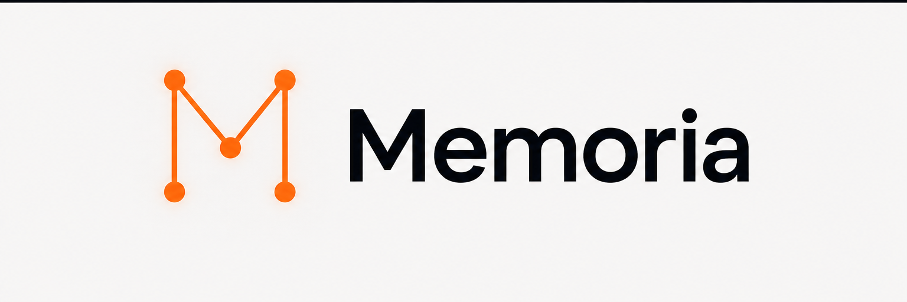

<p align="center">
  <picture>
    <source media="(prefers-color-scheme: dark)" srcset="brand/logo-dark.png" />
    
  </picture>
</p>

**Local, multi-agent memory for AI assistants.** Your agents (Claude Code, Codex, OpenClaw, …) each get their own private, persistent memory. What they learn *about you* is pooled in one shared space; everything else stays private unless you share it. 100% local storage, no telemetry, open source.

> *Human-machine memory is our memory. Local, ours, and it never starts from zero.*

**Status: public beta** — V3 in active development on the `memoria-v1` branch, a ground-up rebuild of the former OpenClaw plugin (now archived in [`legacy/`](legacy/)). See [`docs/v3/STATUS.md`](docs/v3/STATUS.md) for the measured state (tests, screens, tools) and [`docs/v3/TODO.md`](docs/v3/TODO.md) for what is left.

## Install (macOS)

One command in the Terminal — requires [Node.js 20 or newer](https://nodejs.org) (22 LTS recommended):

```sh
curl -fsSL https://raw.githubusercontent.com/Primo-Studio/openclaw-memoria/memoria-v1/scripts/install-memoria.sh | sh
```

The script checks prerequisites, installs Memoria, starts the local service as a **launchd** agent (auto-start at login, restarted if it dies) and opens the web UI. From there the onboarding guides you:

1. **Pick your intelligence engine.** OpenAI (`gpt-4o-mini`, recommended — an API key, zero installation, usage cost shown in Settings) or, for a 100% local setup, Ollama (advanced — the onboarding detects whether your machine is powerful enough and can install the model in one click), LM Studio, Anthropic or OpenRouter.
2. **Detect the agents** on your machine and connect them in one click (or paste a pairing code in a remote agent's chat: `memoria pair claude-code`).
3. Optionally **import their existing memories** (conversation transcripts go through Review; a legacy OpenClaw memory is adopted as is).

Reopen the UI anytime with `memoria ui` (or just `memoria`), update with `memoria update`, get a full health report with `memoria doctor` (storage, extraction queue, 24 h activity, data sent to the cloud, model cost).

🌐 **Website:** [primo-studio.fr/app/memoria](https://primo-studio.fr/app/memoria) · 🐛 [Report a bug](https://github.com/Primo-Studio/openclaw-memoria/issues) · 📚 In-app **Docs** tab (5 languages)

---

## Why V3

The previous Memoria was an OpenClaw plugin, coupled to its host's hooks — and an OpenClaw update broke it. V3 fixes that at the root:

- **`@memoria/core`** — the engine. No host hooks, no network. Governed schema (users, organizations, clients, projects, scopes, policies), hybrid recall (FTS5 + sqlite-vec + entity graph) with hard client-isolation, hard-delete, neutral audit log, 24 cognitive layers.
- **`@memoria/daemon`** — a single local process owns the databases. Serialized writes, HTTP on `127.0.0.1` with token auth, singleton lock, `/v1/health` exposing pid / supervisor / built SHA.
- **`@memoria/mcp`** — one MCP server per agent (12 tools), relaying to the daemon. Connect any MCP-capable agent with one pasted command.
- **`@memoria/cli`** — `memoria ui | init | doctor | pair | import | export | forget | sync | …` (28 commands).
- **`@memoria/web`** — local web UI served by the daemon (16 screens, 5 languages, no terminal needed): connect agents, browse memory, review, share, pause, see what went to the cloud and what it cost.
- **`packages/adapter-openclaw`** — hosts become thin adapters (OpenClaw is just one of them).
- **`apps/desktop`** — `Memoria.app` (Tauri): menu-bar **M** icon (green = active, red = down, grey = starting), starts the daemon through launchd.

### Principles

1. **Local-first, absolutely.** Nothing leaves your machine except the AI engine you explicitly choose — and every cloud send is logged (Settings → *Data sent to the cloud*, `memoria doctor`).
2. **One memory per agent.** Each assistant instance is a digital person with private memory. What an agent learns *about you* can be declared into the shared `user` space, read by all your assistants (OpenClaw channel bots stay read-only); promoting a *private* memory to shared is always your click.
3. **Memoria governs, agents propose.** Schema, dedup, redaction, audit and deletion belong to Memoria. Capture modes: *Auto* (captured and declared facts active), *Review first* (everything waits for your validation), *Pause* (nothing is written).
4. **Secrets never enter memory.** Hard redaction gate before storage; values live in the macOS Keychain (or an AES-256-GCM vault), memory only keeps references — never in logs, replies, screen or network.
5. **Client isolation is non-negotiable.** The recall benchmark enforces a **0% cross-client leak rate** in CI.
6. **Free for users and for us.** No hosted infra, no telemetry, Apache-2.0.

## Development

```bash
npm install
npm run build     # tsc strict — 0 errors tolerated
npm test          # vitest — 980 tests / 105 files (2026-08-27), includes the recall-quality benchmark
node scripts/boot-test.mjs
```

Node ≥ 20 (`package.json` engines). Native deps: `better-sqlite3`, `sqlite-vec`. The daemon serves the built `packages/*/dist`: after a rebuild, `memoria stop && memoria start` (or `memoria update`).

- Build & contribution docs: [`docs/v3/`](docs/v3/) — [`STATUS.md`](docs/v3/STATUS.md) (measured state), [`TODO.md`](docs/v3/TODO.md) (handoff), [`JOURNAL-2026-08-27.md`](docs/v3/JOURNAL-2026-08-27.md) (latest session), [`DECISIONS-LOG.md`](docs/v3/DECISIONS-LOG.md), [`COUCHES-ETAT.md`](docs/v3/COUCHES-ETAT.md) (24 layers), [`INSTALLATION-RESEAU.md`](docs/v3/INSTALLATION-RESEAU.md) (non-technical install + multi-machine sync), [`SYNC-INTER-MACHINES.md`](docs/v3/SYNC-INTER-MACHINES.md), [`port-map.json`](docs/v3/port-map.json) (legacy port map).
- The frozen build spec lives in the project's dev dossier (`PLAN-Memoria-v3-2026-06-03.md`).

## License

Apache-2.0 © Primo-Studio
