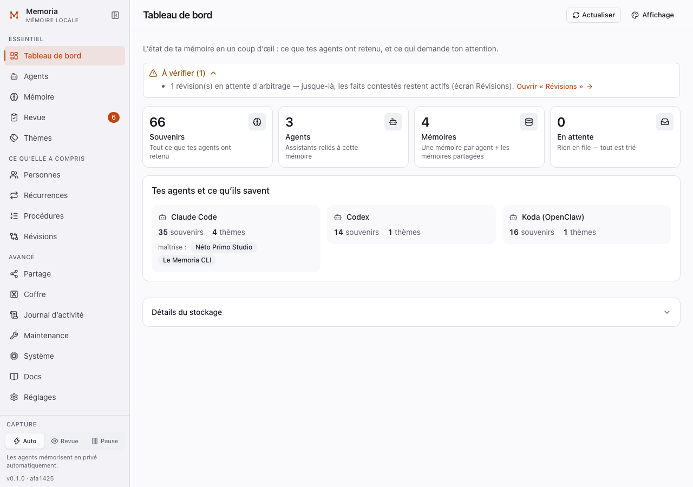
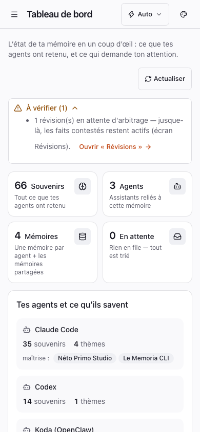
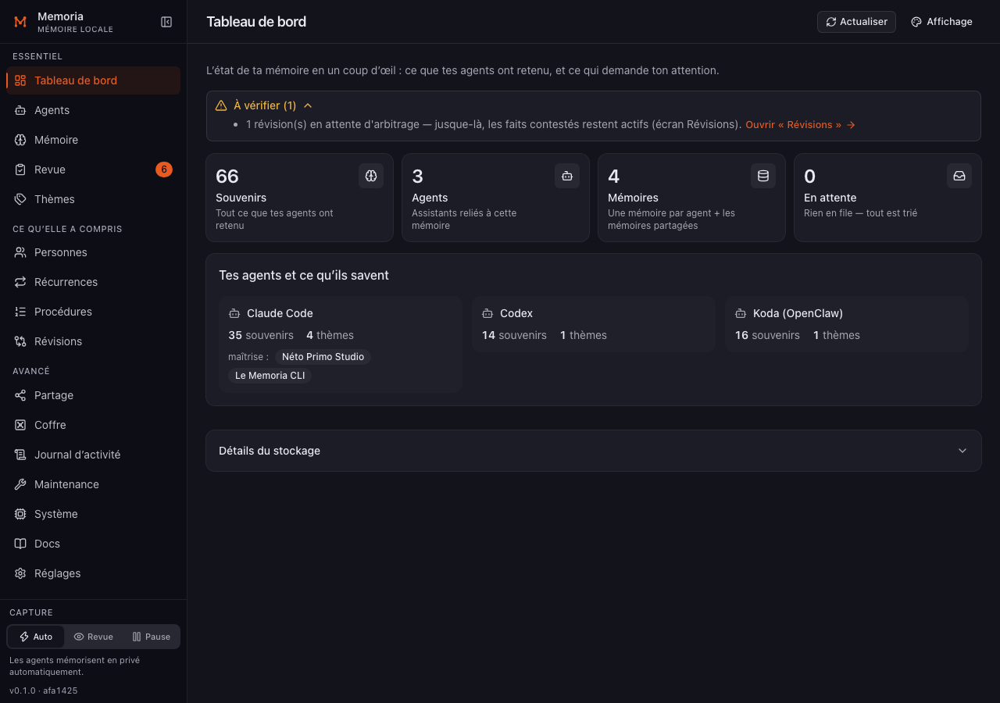
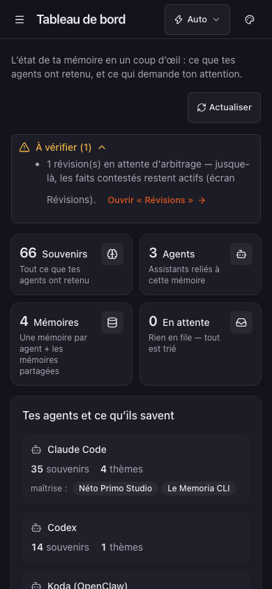

# UI-GUIDE — interface web Memoria sur shadcn/ui

Ce guide dit **comment écrire un écran** de `packages/web` depuis la refonte
shadcn. Lecteur : un agent (Claude Code,
Codex…) ou un humain qui touche à l'UI. Utilisateur final : Néto, non
technicien — chaque décision ci-dessous sert la lisibilité, pas la technique.

## 1. Pile et fichiers

| Quoi | Où |
|---|---|
| Tailwind v4 + jetons de thème | `src/index.css` (entrée), `src/styles/tokens.css` (couleurs, radius, polices) |
| Composants shadcn générés (radix-nova) | `src/components/ui/*.tsx` — Button, Card, Badge, Alert, AlertDialog, Dialog, Sheet, DropdownMenu, Select, Tabs, Table, Input, Textarea, Checkbox, Switch, Label, Popover, Tooltip, Progress, ScrollArea, Separator, Skeleton, Collapsible, Sonner (toasts) |
| **Primitives d'écran (point d'entrée unique)** | `src/components/ui.tsx` — `PageHeader`, `SectionCard`, `StatCard`, `DataTable`, `DataCards`, `Spinner`, `ErrorBanner`, `EmptyState`, `ConfirmButton`, `CopyButton` + helpers (`useLoad`, `listPhase`, `humanError`, `useIsNarrow`, `formatDate/Number/Bytes…`, `agentTypeLabel`) |
| Coquille (sidebar, barre supérieure, capture, préférences) | `src/app/Shell.tsx`, `src/app/nav.ts` (routes, icônes, groupes), `src/app/CaptureModeSwitch.tsx` + `src/app/capture-mode.ts` (état partagé), `src/app/shell-context.ts` |
| Thème | `src/lib/theme.ts` (résolution Système → light/dark, `?theme=`), script inline dans `index.html` (anti-flash) |
| Aperçu + captures | `node scripts/ui-preview.mjs [--screenshot DIR]` (racine du dépôt, `npm run ui:preview`) |

Écran de référence : `src/screens/Dashboard.tsx`.

## 2. Écrire un écran, pas à pas

1. **Titre et actions** → `PageHeader` :
   ```tsx
   <PageHeader
     title={t('agents.title')}
     description={t('agents.lead')}          // facultatif, reste dans le flux
     actions={<Button variant="outline" size="sm" onClick={reload}><RefreshCw />{t('common.refresh')}</Button>}
   />
   ```
   Le titre est **projeté dans la barre supérieure** (portail,
   `app/shell-context.ts`) : ne pas rendre de `<h1>` ailleurs. Les actions y
   vont aussi sur bureau, et descendent en tête de page sous 768 px — **après**
   la description, jamais avant : au téléphone, l'écran doit s'ouvrir sur la
   phrase qui dit à quoi il sert, pas sur un bouton seul dans une bande vide.
   L'intro passe donc TOUJOURS par `description` (qui accepte un `ReactNode`,
   pour mettre un mot en gras) et jamais par `children` : rendue en `children`,
   elle repasserait sous les actions.
2. **Structurer en `SectionCard`** (un bloc titré par sujet) :
   ```tsx
   <SectionCard title={t('agents.list.title')} description={…} actions={…}>
     …contenu…
   </SectionCard>
   ```
3. **Tableaux → `DataTable`** (jamais `<table className="table">`, jamais `<th onClick>`) :
   ```tsx
   const columns: DataColumn<AuditEntry>[] = [
     { id: 'ts', header: t('audit.col.date'), sortable: true, cell: e => formatDate(e.ts) },
     { id: 'action', header: t('audit.col.action'), cell: e => e.action },
     { id: 'size', header: t('…'), align: 'right', cell: e => formatBytes(e.size) },
   ]
   <DataTable columns={columns} rows={sorted} rowKey={e => e.id} sort={sort} onSort={setSort} />
   ```
   Le tri reste à l'appelant (`lib/sort.ts`) ; l'en-tête triable est un **bouton**
   avec `aria-sort`. **Sous 640 px, `DataTable` se rend tout seul en FICHES**
   (une par ligne) : à 390 px, un tableau de cinq colonnes était coupé net au
   bord de sa carte et des colonnes entières disparaissaient. Ne remets un
   tableau au téléphone qu'en connaissance de cause (`mobile="table"`) ; sur
   bureau, le débordement horizontal est signalé par une ombre (`scroll-shadow-x`).
4. **Chiffres clés → `StatCard`** (`tone="warn"` quand il faut regarder, `ok`, `danger`).
5. **États** — toujours les trois, jamais un vide muet :
   ```tsx
   {state.status === 'loading' && <Spinner />}            // ou un <Skeleton> à la forme de l'écran
   {state.status === 'error' && <ErrorBanner message={state.message} onRetry={reload} />}
   {state.status === 'ready' && items.length === 0 && <EmptyState title={…} body={…} action={…} />}
   ```
   `useLoad` et `listPhase` sont inchangés.
6. **Formulaires** : `Label` + `Input`/`Textarea`/`Select`/`Checkbox`/`Switch`
   (`src/components/ui/*`), `Button` pour soumettre (`variant="default"` = action
   principale orange, une seule par écran ; `outline`/`ghost` pour le reste ;
   `destructive` pour ce qui supprime). Choix parmi une liste courte → `Select`
   shadcn ; deux ou trois modes → segmented control (voir `CaptureModeSwitch`).
7. **Confirmations** : `ConfirmButton` ouvre un `AlertDialog` (titre = libellé,
   `description` facultative, action en style destructif). Plus de double-clic armé.
8. **Retour d'action** : `toast.success(t('…'))` / `toast.error(…)` de `sonner`
   (le `Toaster` est monté dans App.tsx). `CopyButton` le fait déjà.
9. **i18n** : chaque chaîne visible passe par `t('…')` ; nouvelle clé = **dans
    les 5 catalogues** (`src/messages/{fr,en,es,pt,de}.ts`, parité stricte
    vérifiée par `test/i18n-parity.test.ts`). Les composants générés qui
    portaient du texte en dur (`Sheet` « Close ») prennent une prop `closeLabel`.
10. **Vérifier** : `npx tsc -p packages/web/tsconfig.json --noEmit`,
    `npm run build`, `npx vitest run packages/web/test`, puis
    `node scripts/ui-preview.mjs --screenshot /tmp/ui` et **regarder** les 4
    captures de l'écran (clair/sombre × bureau/mobile).

## 3. Interdits

- **Couleur codée en dur** (`#fff`, `rgb(…)`, `text-[#e85a1f]`) : uniquement les
  jetons (`bg-primary`, `text-muted-foreground`, `border-border`, `bg-success/10`…).
  Le thème clair/sombre est piloté par `data-theme` sur `<html>` ; la variante
  `dark:` de Tailwind suit cet attribut, jamais `prefers-color-scheme` directement.
- **`<select>` natif nu** dans un écran migré → `Select` shadcn (ou segmented control).
- **`<th onClick>`** / en-tête cliquable qui n'est pas un bouton → `DataTable`.
- **Texte hors `t()`** (y compris `aria-label`, `title`, `sr-only`, placeholders).
- **`<h1>` dans le corps d'un écran migré** : le titre vit dans `PageHeader`.
- **Feuille de style maison** : il n'y en a plus (l'ancien `styles.css` a été
  supprimé une fois les 16 écrans réécrits). Tout passe par Tailwind + `ui/*`.
- **Cible tactile sous 44 px** au téléphone : `size="sm"` porte déjà le plancher
  (`max-sm:h-11`), ne le neutralise pas avec une hauteur en dur. La taille par
  défaut (`h-8`) ne l'a PAS : sur un bouton d'action au téléphone, ajoute
  `className="max-sm:h-11"` (et non `size="sm"`, qui vaut 28 px sur bureau et
  désaligne le bouton du champ voisin). Connu et non traité : `Input` et
  `Select` sont à 32 px au doigt sur tous les écrans.
- **Pastille cliquable seule** dans une liste dense : c'est la LIGNE (ou le
  texte de la carte) qui prend le clic, pas la case ou l'interrupteur de 16-18 px
  — voir `Sharing.tsx` et `MemFactCard.tsx`. Un `<label>` ne suffit pas : les
  contrôles Radix sont des `<button role="switch">`, on passe donc par un
  `onClick` sur le conteneur, avec `stopPropagation` sur le contrôle. **Aucune
  capture ne prouve qu'une zone est cliquable** : ça se vérifie dans le
  navigateur. Et n'agrandis pas le pseudo-élément `after` d'un interrupteur dans
  une liste de lignes de 41 px : il déborderait sur les lignes voisines.
- **Largeur qui déborde** : un contenu large (tableau, chemin, JSON) défile dans
  son conteneur (`overflow-x-auto`), jamais la page.
- **Styles inline** pour la couleur ou l'espacement.

## 4. Jetons (`src/styles/tokens.css`)

| Jeton | Rôle | Classes Tailwind |
|---|---|---|
| `--background` / `--foreground` | fond et texte de page | `bg-background`, `text-foreground` |
| `--card` / `--card-foreground` | cartes | `bg-card` |
| `--popover` | menus, dialogues, tiroirs | `bg-popover` |
| `--primary` / `--primary-foreground` | **accent orange Primo** (`#e85a1f` sombre, `#c04410` clair) : action principale, actif, marque | `bg-primary`, `text-primary`, `bg-primary/10` |
| `--secondary`, `--muted`, `--accent` | fonds neutres (boutons secondaires, zones atténuées, survol) | `bg-muted`, `hover:bg-accent` |
| `--muted-foreground` | texte secondaire | `text-muted-foreground` |
| `--destructive` | suppression, erreur | `text-destructive`, `bg-destructive/10` |
| `--success`, `--warning` (+ `-foreground`) | sain / à regarder | `text-success`, `text-warning`, `ring-warning/40` |
| `--border`, `--input`, `--ring` | bordures, champs, focus | `border-border`, `ring-ring/50` |
| `--sidebar*` | barre latérale | `bg-sidebar`, `border-sidebar-border`, `bg-sidebar-accent` |
| `--chart-1…5` | séries de graphiques (1 = orange) | `text-chart-2`… |
| `--radius` = 0.5rem | arrondis | `rounded-md` / `rounded-lg` / `rounded-xl` |
| `--font-sans` = system-ui ; `--font-mono` | polices | `font-sans`, `font-mono` |

Les deux palettes sont complètes ; en ajouter un jeton = l'ajouter dans `:root`,
`:root[data-theme='dark']` **et** `@theme inline`.

**Contraste** : deux pires cas, tous deux mesurés en tête de `tokens.css`.
(1) `--success`, `--warning` et `--destructive` servent de couleur de TEXTE sur
un fond teinté à 10-12 % de la même couleur (badges, bouton « Supprimer »).
(2) La paire pleine `--primary` / `--primary-foreground` porte le bouton
principal, le badge par défaut et la pastille de modèle en mono 12 px — en
thème sombre l'encre est SOMBRE sur l'orange vif (même motif que
`--success-foreground`), ne la repasse pas en blanc sans re-mesurer. Le survol
du bouton plein mélange vers `--foreground` au lieu de diluer l'orange
(`bg-primary/80` faisait tomber le libellé sous le seuil). Toute retouche se
re-mesure (seuil AA = 4,5:1), elle ne se juge pas à l'œil.

## 5. Coquille

- Groupes de navigation et icônes : `NAV_GROUPS` dans `src/app/nav.ts` — trois
  groupes (l'essentiel du quotidien ; ce que Memoria a déduit seul ; le contrôle
  et le diagnostic). Une nouvelle route = un `ScreenId`, une entrée dans un
  groupe, la clé `nav.<id>` dans les 5 catalogues, le rendu dans `App.tsx`.
  **`nav.<id>` doit dire exactement ce que dit le titre de l'écran** : le menu et
  la barre supérieure ne peuvent pas se contredire.
- Badge de la Revue : `reviewCount` passé par App.tsx (rafraîchi toutes les 20 s).
- Barre latérale repliable (préférence `memoria.sidebar`), tiroir `Sheet` sous 768 px.
- Mode de capture : deux formes, un seul état (`app/capture-mode.ts`) —
  `CaptureModeSwitch` en pied de barre latérale, `CaptureModeMenu` dans la barre
  supérieure sous 768 px (sinon l'interrupteur principal du produit est invisible
  au téléphone). Toujours visible (spec §13), y compris en panne.
- Préférences d'affichage (langue, thème) : `PrefsMenu`, à droite de la barre
  supérieure, **libellé « Affichage »** — à ne pas confondre avec l'écran
  « Réglages » (moteur, clés, stockage).
- Sous 768 px, les actions de `PageHeader` descendent en tête de page : la barre
  n'a pas la place de porter à la fois le titre, les actions et la capture.

## 6. Migration terminée (28/08/2026)

Les 16 écrans sont écrits en Tailwind + composants shadcn. `src/styles.css`
(l'ancien CSS maison, scopé sous `.legacy-screen` pendant la transition), son
import, le wrapper de `App.tsx`, la liste `MIGRATED_SCREENS` et les alias de
variables de `tokens.css` ont été **supprimés** : il n'y a plus qu'une façon de
styler un écran. Les 64 captures ont été régénérées et relues après la
suppression — aucune régression.

Non couvert par les captures : l'écran **Onboarding**, que `scripts/ui-preview.mjs`
ne peut pas atteindre (le daemon de démo a toujours trois agents reliés, donc
l'onboarding ne se déclenche jamais). Il a été vérifié par lecture : aucune
classe de l'ancien CSS.

## 7. Captures de référence — Tableau de bord

Générées par `node scripts/ui-preview.mjs --screenshot <dossier>` (données de
démo, faux moteur d'extraction, aucun réseau) ; fichiers
`dashboard-{light,dark}-{desktop,mobile}.png`. Copies de référence dans
`packages/web/docs/ui-reference/`.

| | Bureau 1280×900 | Mobile 390×844 |
|---|---|---|
| Clair |  |  |
| Sombre |  |  |
